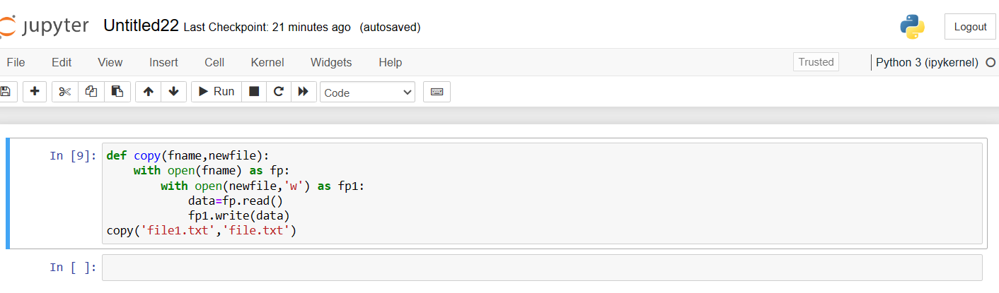

# Copy-File
## AIM:
To write a python program for copying the contents from one file to another file.
## EQUIPEMENT'S REQUIRED: 
PC
Anaconda - Python 3.7
## ALGORITHM: 
### Step 1:
Open a existing file with read mode. 
### Step 2: 
Create a new file without closing the existing file.
### Step 3: 
read the data from existing file.
### Step 4:  
Write the readed data in created new file.
### Step 5: 
close both the file pointer 
### Step 6: 
End the program.
## PROGRAM:
```
Developed by:Karthikeyan P
REGISTER NO:212223230102
```
```py
def copy(fname,newfile):
    with open(fname) as fp:
        with open(newfile,'w') as fp1:
            data=fp.read()
            fp1.write(data)
copy('file1.txt','file.txt')       
```
### OUTPUT:



## RESULT:
Thus the program is written to copy the contents from one file to another file.
